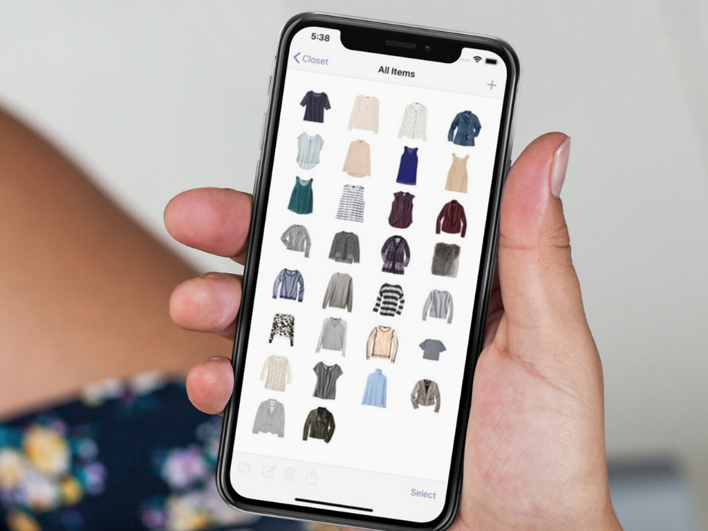

# Virtuele kledingkast 

## Onderzoeksvraag

Hoe kan Petra (gedeeltelijk) zelfstandig kleding combineren, zonder te zien?

## Probleemdefinitie

Petra, heeft moeite met het onderscheiden van kleding. Ze is namelijk blind en kan daardoor niet goed onderscheid maken tussen de kleding stukken. Dit maakt het matchen van kleding moeilijk. 

## Oplossing

Voor het matching aspect van probleem heb ik bedacht om van te voren uit te zoeken welke kleding stukken matchen en deze bij het kiezen van 1 kleding stuk als suggestie mee te geven. Als petra dan een kleding stuk kiest, krijgt zij alleen suggesties voor kleding dat matched met het gekozen kleding stuk + gelegenheid.

## Link prototype

Hier een link naar de [demo.](https://mitchel-ds.github.io/human-centered-design-2223/)

## Opdracht

### Ontwerpen met en voor echte mensen

## Week 1 - Intro en aannames testen 

### Woensdag 19 april

### Donderdag 20 april

### Vrijdag 21 april

## Week 2 - Prototypen en testen 

### Woensdag 26 april

## Week 3 - Prototypen, presenteren en reflecteren

### Woensdag 10 mei

### Donderdag 11 mei

### Vrijdag 12 mei

<!-- ☝️ replace this description with a description of your own work -->

<!-- replace the code in the /docs folder with your own, so you can showcase your work with GitHub Pages 🌍 -->

<!-- Add a nice poster image here at the end of the week, showing off your shiny frontend 📸 -->

<!-- Maybe a table of contents here? 📚 -->

<!-- How about a section that describes how to install this project? 🤓 -->

<!-- ...but how does one use this project? What are its features 🤔 -->

### License
This repository is licensed as [MIT](LICENSE).
