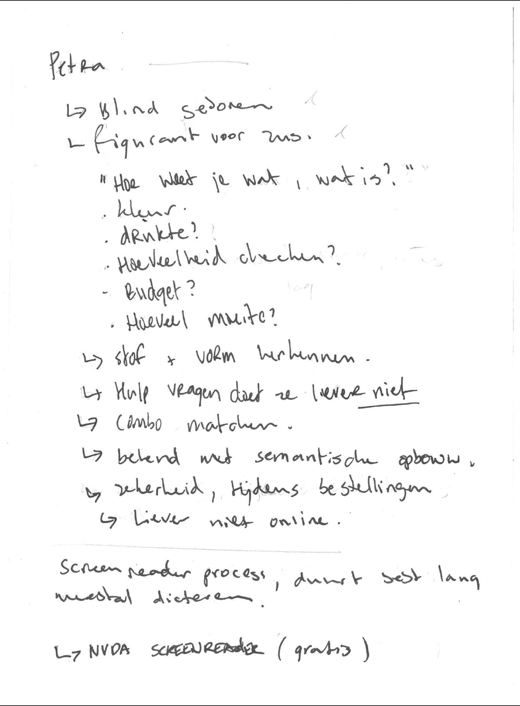
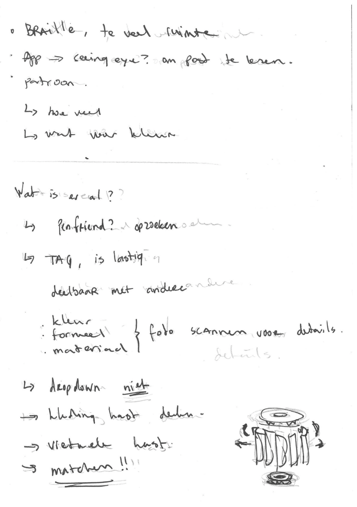
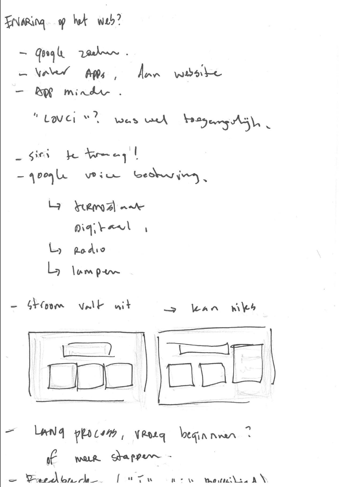
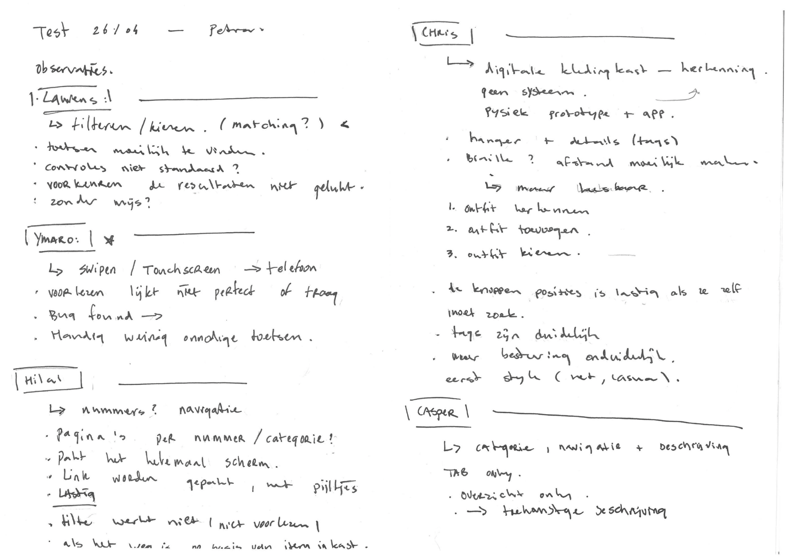

# Petra's virtuele kledingkast 

[Source](https://i0.wp.com/zerrin.com/wp-content/uploads/2021/10/online-wardrobe-closet-organizing-app-zerrin.png?fit=1024%2C768&ssl=1)

## Onderzoeksvraag

Hoe kan Petra (gedeeltelijk) zelfstandig kleding combineren, zonder te zien?

## Probleemdefinitie

Petra, heeft moeite met het onderscheiden van kleding. Ze is namelijk blind en kan daardoor niet goed onderscheid maken tussen de kleding stukken. Dit maakt het zelfstandig matchen van kleding moeilijk. Ze kan bij sommige kleding stukken wel herkennen aan textuur of materiaal, maar zij wilt graag een makkelijkere manier om kleding te kunnen matchen en combineren.

## Oplossing

Voor het matching aspect van probleem heb ik bedacht om van te voren uit te zoeken welke kleding stukken matchen en deze bij het kiezen van 1 kleding stuk als suggestie mee te geven. Als petra dan een kleding stuk kiest, krijgt zij alleen suggesties voor kleding dat matched met het gekozen kleding stuk. Op deze manier krijgt ze al gelijk kleding stukken aangeboden die bij elkaar passen in plaats van door haar hele kleding kast heen te gaan.

## Link prototype

Hier een link naar de [demo.](https://mitchel-ds.github.io/human-centered-design-2223/)

## Opdracht

De opdracht is om een virtuele kledingkast te maken voor Petra. Petra is blind en heeft moeite met het onderscheiden van kleding. Ze heeft een kledingkast vol met kleding, maar kan niet goed onderscheid maken tussen de kleding stukken. Ze kan bij sommige kleding stukken wel herkennen aan textuur of materiaal, maar zij wilt graag een makkelijkere manier om kleding te kunnen matchen en combineren.

### Focus

Omdat deze opdracht namelijk in groepsverband was en wij allemaal wel in dezelfde richting zaten, heb ik mijn focus meer gelegd op het makkelijk kunnen navigeren door applicatie met behulp van de screenreader en hoe ik de toeganglijkheid van de applicatie kan verbeteren. Ook focus ik me op het combineren van de kleding stukken.

### Ontwerpen met en voor echte mensen

Petra is een echte gebruiker en daarom is het belangrijk om haar te betrekken bij het ontwerpproces. Dit doe ik door middel van een interview en zo veel mogelijk testen.

## Design Principles

### Study situation

*"In order to become specialist designers for all kinds of people with all kinds of disabilities we have to study different, individual situations."*

Petra is blind geboren. Hierdoor beleefd zij haar dagelijks leven heel anders dan mij. Om een goed concept te verzinnen moet ik mij verdiepen in haar situatie. 

Waar maakt ze dagelijks gebruik van? Wat zijn haar gewoontes? Wat zijn haar beperkingen? Hoe werkt het op dit moment met kleren uitzoeken? 

Ze maakt gebruik van een screenreader op haar telefoon, maar zij kan gewoon een laptop gerbuiken met een special toetsenbord. Ze kan dus gewoon gebruik maken van een website. Bij het uitzoeken van haar kleren maakt ze gebruik van haar geheugen en hulp van haar man. Dit heeft niet altijd tijd om te helpen.

Ook foto's maken vereist wel wat tijd, dus om een app te gebruiken die kleding herkent of in ieder geval de kleur vereist te veel moeite voor de kleine impact die het heeft.

### Prioritise identity

*"Including excluded people into our design process, by seeing them as co-designers rather than study objects, can help in coming up with new, and relevant, conventions."*

Door Petra bij het ontwerp proces te betrekken kunnen we een beter beeld krijgen van wat zij belangrijk vindt. Hierdoor wordt het concept ook wat persoonlijker. We maken het namelijk voor haar specifiek, dus we hoeven eigenlijk geen rekening te houden met andere mensen. We testen daarom ook zo veel mogelijk met haar en proberen haar indentiteit er zo veel mogelijk in te verwerken.

Zij maakt gebruik van de NVDA screenreader, dus ik heb mijn concept ook afgestemd en getest op deze screenreader.

Bijvoorbeeld vond ze het ook handig als de terug knop helemaal boven aan stond, dit is normaal niet zo, maar voor haar is dat makkelijker. Dit heb ik daarom ook over weer toegepast.

Ook wilde ze misschein iets met **AI**, helaas weet ik daar weinig van af, dus heb ik het niet kunnen toepassen. Het zou wel nice zijn though, misschien in de toekosmt.

### Ignore conventions

*"The current conventions are designed by, and thus for, designers. Not all of these conventions work for non-designers. If we want to include non-designers, and especially people with disabilities, we should reconsider these conventions, after we studied their situations."*

Wij als designers, vooral op CMD, zijn bepaalde conventies gewent. Hierdoor houden wij vaak rekening met deze conventies, maar deze zijn niet altijd afgesteld op iedereen. Vooral niet op mensen met een beperking. 

Petra kan namelijk niet zien, dus heel van de design conventies maken voor haar niet uit. Ze is namelijk wel gewent met semantische HTML, omdat ze namelijk gewoon een screenreader gebruikt, dus ik heb mijn website natuurlijk zo toeganglijk mogelijk gemaakt voor een screenreader. 

Aan het ontwerp heb ik vrijwel niks gedaan, want dat kan ze toch niet zien!

### Add nonsense

*"Designing for people with disabilities is in large part uncharted territory. Nonsense can be a useful tool to investigate the unkown. And it’s fun."*

Na het kiezen van haar volledige outfit krijgt zijn een bericht, bijvoorbeeld "leuke outfit!", of "staat je goed!". Dit is natuurlijk niet echt nodig, maar het is wel gewoon grappig om er bij toe te voegen aangezien de applicatie namelijk toch niet weet hoe het er echt uit ziet.

Tijdens het testen was dit wel grappig, of dit helpt bij het verbeteren van de totale ervaring weet ik niet, maar een soort feedback terug krijgen is natuurlijk wel grappig.

## User scenario

Petra wilt graag zelfstandig kleding kunnen combineren en matchen. Ze wilt graag een applicatie die haar hier bij kan helpen. Ze wilt graag een applicatie die haar kleding stukken aanbiedt die bij elkaar passen en geschikt zijn voor de gelegenheid.

### Who?

Petra, is blind geboren, is getrouwd en werkt als beleidsmedewerker. Ze houdt er van uitgaan met vriendinnen en shoppen. Bij het uitzoeken van haar kleding herkent ze die meestal aan de textuur of materiaal. Ze houdt niet graag van het vragen van hulp en doet dit ook weinig. 

### What?

Graag wilt Petra, weten welke kleding stukken bij elkaar passen en welke kleding stukken geschikt zijn voor welke gelegenheid. Dit vraagt ze op dit moment meestal aan haar man of vriendinnen, maar dat gaat niet altijd even makkelijk. Dit wilt ze gewoon zelf kunnen doen.

### How?

Door een applicatie te bouwen van haar virtuele kleding kast die haar de opties geeft welke kleding stuk zij wilt gaan dragen en op basis daar van andere kleding stukken aanbiedt die bij elkaar passen en geschikt zijn voor de gelegenheid. Op deze manier krijgt ze makkelijk suggesties over wat ze aan kan trekken.

### Why?

Op deze manier kan Petra zelfstanding, zonder hulp van anderen, kleding combineren en matchen. Dit geeft haar een gevoel van zelfstandigheid en vrijheid. Hierdoor kan ze alles gewoon zelf doen, en indien ze dat zelf wilt - hulp inschakelen van anderen (maar dat zo min mogelijk).

## Week 1 - Intro en aannames testen 

### Woensdag 19 april - Introductie

Door persoonlijke omstandigheden was ik helaas niet bij de intro van dit vak, maar heb ik wel gewoon van mijn mede studenten de opdracht meegekregen. De groepjes waren al aangemaakt, dus ik moest mij alleen even bij een groepje aansluiten. 

Op dit moment hadden wij als groep, Petra nog niet ontmoet, dus het bedenken wat voor haar echt belangrijk is, was nog lastig. 

### Donderdag 20 april - Testen voorbereiden

We kregen vandaag een college over hoe je het beste met je test persoon kan testen. Ter voorbereiden hebben we als groep in een google drive, een document aangemaakt met ons testplan voor Petra.

Link naar het [testplan.](https://docs.google.com/document/d/1oQQ9XDxXS25HKwzruN0ERvfCZs9AkTYnjvbtVu1cjoU/edit)

### Vrijdag 21 april - Interview + testen

Vandaag hadden we het eerste interview met Petra. Dit was de eerste keer dat ik mijn groepje zag, dus ik had nog niet echt iets gemaakt wat heel uitgebreid was, maar Petra kon wel gewoon even erdoorheen gaan en hardop denken.

Ik had nog veel kunnen doen, maar dit was de eerste versie van mij concept. Petra kreeg hier de opties om verschillende kleding stukken te kiezen. Het ging hier bij mij meer om het navigeren en hoe ik dit kon verbeteren. Na het kiezen van haar kleding stukken kreeg ze een melding of dit wel echt matched of niet. Het probleem hierbij is dan dat ze elk kleding stuk af moet gaan om te kijken of ze matchen of niet. Dit is natuurlijk niet echt handig, dus dit moest ik nog verbeteren.

#### Bevindingen interview

Een aantal bevindingen die mij zijn bijgebleven die voor mij van belang zijn waren: 

- Petra vindt Siri te traag. Ze gebruikt daarom zelf ook NVDA screenreader. Deze is gratis en veel sneller, omdat je de snelheid zelf kan instellen.
- Petra is al best bekend met de hierarchie van een website. Ze weet dat de belangrijkste informatie bovenaan staat en dat je met tab door de pagina kan navigeren. 
- Er vond al een kleine test plaats van mijn teamgenoot en die had een dropdown gebruikt, dit werkte niet echt heel goed en voor radio buttons werkte het anders per browser.
- Ze heeft op dit moment niet echt een systeem hoe ze haar kleding kast indeelt. 
- Ze wilt indien nodig haar kleding kast kunnen delen met haar vriendinnen om op die manier extra hulp te krijgen.
- Een AI die haar kleding automatisch kan matchen?
- Haar grootste belang is het matchen van haar kleding.

#### Conclusie interview 1 

> "Petra wilt graag een systeem die haar kleding kan matchen en combineren. Ze wilt graag een systeem die haar kleding kast kan omzetten naar een digitale versie, die haar makkelijk kan helpen met het aanbieden van kleding stukken die bij elkaar passen en geschikt zijn voor de gelegenheid. + desnoods een functie om kleding te kunnen delen met haar vriendinnen voor extra hulp."

## Week 2 - Prototypen en testen 

### Woensdag 26 april - Tweede interview + testen

Vandaag hadden we het tweede interview met Petra, dus we konden hier onze verwerkte bevindingen gaan testen. Dit was ook gelijk de laaste interview met Petra, wat best jammer is, omdat bij de eindoplevering, Petra niet aanwezig is.

#### Bevindingen interview 2

- Het navigeren door de pagina met tab ging voornamelijk wel goed, maar misschien bij te veel informatie gaat het navigeren wat lastiger.
- Ze had wel hulp nodig bij het opzetten. Ze wist niet helemaal waar de knoppen waren.
- Te veel keuzes op 1 pagina.

#### Conclusie interview 2

> "De test ging opzich wel goed, de core functionaliteit werkte en kon ze besturen. Omdat het natuurlijk op een laptop is, is het natuurlijk niet altijd even makkelijk te gebruiken."

#### Verbeteringen prototype

- De kleding categorieen verdelen over meerdere pagina's. Hierdoor blijft je aandacht bij 1 ding en is het makkelijker om te navigeren.
- Nu geeft de app een aanbeveling wat de gebruiker kan dragen, misschien is het handiger om gelijk alleen de kleding stukken te laten zien ze per stijl kan dragen.

Hierbij heb ik de verbeteringen van de vorige test toegepast. Ik heb de kleding categorieen opverdeeld, dit maakt het filteren veel makkelijker. Ook hoeft Petra niet meer de hele kleding kast door te lopen, maar krijgt ze gewoon alleen de combos die werken met het gekozen kleding stuk. 

Ook krijgt ze kleine feedback om het leuker te maken. Zoals bijvoorbeeld: "Je ziet er goed uit vandaag!" of "Je ziet er geweldig uit vandaag!". Dit is natuurlijk niet echt nodig, maar het maakt het wel leuker.

## Week 3 - Prototypen, presenteren en reflecteren

### Woensdag 10 mei - Prototypen

Voornamelijk bezig geweest met het maken van de documentatie en prototype.

### Donderdag 11 mei - Presentatie

Het was de bedoeling om onze bevindingen te gaan presenteren die uit ons onderzoek zijn gekomen. Helaas was Petra hier niet bij, maar Eric was er wel. 

We kregen voor de les even tijd om onze presentaties voor te bereide. Dit hebben even snel in groepsverband gedaan. Samen hebben we even de belangrijkste punten uit ons onderzoek gehaald en deze in een presentatie gezet. Dit werd niet door iedereen gepresenteerd, maar door 1 iemand van de groep. 

Link naar de [presentatie.](https://docs.google.com/presentation/d/1CeNEhJFS1ypGw_i1eTxKXGO0IRABJ7lAkgF81yPrGc8/edit?usp=sharing)

## Toekomstige verbeteringen

Natuurlijk heb ik niet alles wat ik wilde kunnen verwerken in het concept. Hieronder een lijstje met dingen die ik in de toekomst nog zou willen toevoegen als ik daar tijd voor zou hebben. 

- Op dit moment worden de kleding combinaties van te voren gemaakt en moeten ook telkens worden geupdate als er een nieuw kleding stuk wordt toegevoegd. Het zou mooi zijn als de AI zelf kleding combinaties kan maken en deze kan voorstellen aan Petra.
- Een database aanmaken met al haar kleding stukken. Dan kan ze zelf ook kleding toevoegen, verwijderen of aanpassen.
- Het is op dit moment natuurlijk een web applicatie, maar het is niet handig om elke keer een laptop of computer er bij te halen om je kleren uit te zoeken. Het zou mooi zijn als het een mobiele applicatie wordt, zodat ze het gewoon op haar telefoon kan doen. 

### License
This repository is licensed as [MIT](LICENSE).
